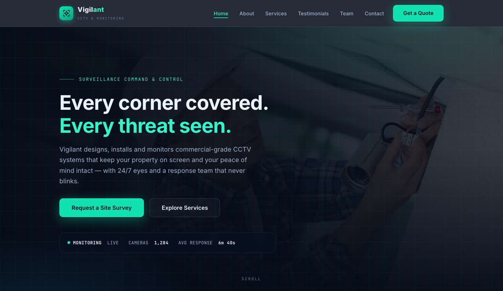

# Vigilant — Professional CCTV Installation &amp; Security Monitoring

A premium, fully responsive HTML template for a CCTV and security monitoring company. The design pairs a deep command-centre navy with electric signal-teal accents, mono type accents and a confident grid — positioning the firm as the watchful eye behind homes and businesses that never sleep.

## 📸 Screenshot

## Design System

| Token | Value |
|-------|-------|
| **Primary palette** | `--navy-900` `#081120`, `--navy-800` `#0C1A30`, `--navy-700` `#122540` |
| **Accent** | `--signal-500` `#12E2B2`, `--signal-400` `#35F2C8`, `--sky-400` `#4CC3FF` |
| **Neutrals** | `--navy-950` `#050B17`, `--paper` `#F4F7FB`, `--amber-400` `#FFC24D`, `--alert-400` `#FF5C5C` |
| **Display type** | `Inter` (sans, 700–800) |
| **Mono type** | `JetBrains Mono` (400–700) |
| **Container** | 1200px max-width, centered |
| **Breakpoints** | ~980px (tablet), ~720px (mobile) |

## Pages

| Page | File | Description |
|------|------|-------------|
| Home | [index.html](index.html) | Hero, services grid, monitoring stats, product showcase, CTA |
| About | [about.html](about.html) | Company story, security philosophy, stats |
| Services | [service.html](service.html) | Installation, monitoring & maintenance offerings |
| Testimonials | [testimonial.html](testimonial.html) | Client stories and ratings |
| Team | [team.html](team.html) | The security engineers and operators |
| Quote | [quote.html](quote.html) | Request-a-quote form with `[data-form]` validation |
| Contact | [contact.html](contact.html) | Contact form, service areas, emergency line |
| 404 | [404.html](404.html) | On-brand error page with site navigation |

## Features

- **Framework-free** — pure HTML5, CSS3 (custom properties, Grid, Flexbox, `clamp()`), vanilla JavaScript
- **Command-centre aesthetic** — deep navy palette with signal-teal accents and mono type details
- **Fluid responsive** — 3 breakpoints, no horizontal scroll on any viewport
- **Scroll reveal** — IntersectionObserver-powered `.reveal` animations (respects `prefers-reduced-motion`)
- **Mobile nav** — burger toggle with `aria-expanded` accessible pattern
- **Hero crossfade** — automatic 6s image transition via `.hero-bg img` + `.active` class
- **Form validation** — `[data-form]` hook with `.form-ok` / `.form-err` / `.show` toggle
- **Glyph icons** — custom inline SVG icons in markup, no icon library dependency
- **Original imagery** — production-quality surveillance photography, no placeholders

## Tech Stack

- HTML5 + CSS3 (W3C-valid, semantic landmarks)
- Vanilla JavaScript (76-line IIFE, unmodified canonical build)
- Google Fonts (Inter + JetBrains Mono)
- SVG favicon (inline data: URI)

## SEO

- Semantic HTML5 structure (`<header>`, `<nav>`, `<main>`, `<section>`, `<footer>`)
- Unique `<title>` and `<meta description>` per page
- `lang="en"` attribute, `charset="utf-8"`, viewport meta
- Alt text on all images
- Open Graph / Twitter Card meta tags on every page

## License

Free for personal and commercial use. Attribution appreciated but not required.

---

## Let's Build Something Together 🚀

[Book a free consultation](https://tally.so/r/q4q1L9)
